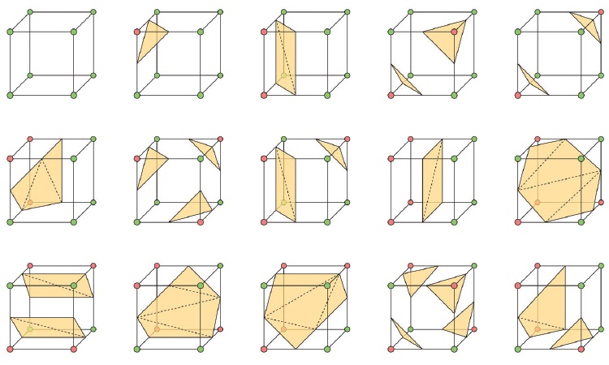

# **Simulation of 3D fluid system**


This repository implements a MLS-MPM based 3D fluid system simulation with [Taichi](https://www.taichi-lang.org/)

This is a course project of [CSE 291 Physics Simulation](https://cseweb.ucsd.edu/~alchern/teaching/cse291_sp23/)


###  1. Introduction

In this project, we use [Taichi](https://www.taichi-lang.org/) to write a program that simulates a 3D fluid system. This system is implemented with [MLS-MPM](https://dl.acm.org/doi/pdf/10.1145/3197517.3201293) (moving least squares material point method). In this designed system, three cute animals are falling in a room. We assign these cute animals different materials: the bunny is in fluid material, the spot is in elastic material and the armadillo is in the snow material (a special elastic material). The MLS-MPM can easily combine these materials together in the same system and we can see the interaction of objects with different materials.

The MLS-MPM is a method of hybrid of lagrangian and eulerian and it is also similar to [APIC](https://dl.acm.org/doi/pdf/10.1145/2766996) (Affine Particle-In-Cell method). The substep can be divided into three parts: particle to grid (P2G),  grid operations and grid to particle (G2P). The initial particles are vertices of input meshes with some translation. We also have $\mathbf{v}_p^{(0)}=0$ for each particle $p$. 


###  2. Implementation

#### 2.1 Particle to Grid

Firstly, we need to compute the deformation gredient $\mathbf{F}$ of each particle $p$. We have

$$
\mathbf{F}_p^{(n+1)}=(\mathbf{I}+\Delta t \nabla \mathbf{v}_p^{(n)}) \mathbf{F}_p^{(n)} \quad \quad \mathbf{F}_p^{(0)}=\mathbf{I}
$$

We use the matrix $\mathbf{C}$ in APIC to approximate $\mathbf{v}_p$ for efficiency here. So we have

$$
\mathbf{F}_p^{(n+1)}=(\mathbf{I}+\Delta t \mathbf{C}_p^{(n)}) \mathbf{F}_p^{(n)}
$$

Then we update the grid momentum (assuming symplectic Euler) for each grid $i$:

$$
(m\mathbf{v})\_i^{(n+1)}=\sum\_{p \in N_i} w\_{ip}m\_p(\mathbf{v}\_p^{(n)}+\mathbf{C}\_p^{(n)}(\mathbf{x}\_i-\mathbf{x}\_p^{(n)}))
+\Delta t(\sum\_{p \in N_i} w\_{ip}m_pg+\mathbf{f}_i^{(n+1)})
$$

There are two terms in this equation. The first term is the previous grid momentum gathered from the particles' momentum (weighted by a quadratic kernel function). The second term is the impulse resulted from gravity and the nodal force $\mathbf{f}_i^{(n+1)}$. $\mathbf{f}_i^{(n+1)}$ is derived from potential energy gradients and have the following final form:

$$
\mathbf{f}\_i^{(n+1)}=-\frac{\partial U}{\partial \mathbf{x}\_i}=\frac{4}{\Delta x^2} \sum\_{p \in N_i} w\_{ip}V\_p^0 \mathbf{P}(\mathbf{F}\_p^{(n+1)})(\mathbf{F}\_p^{(n+1)})^\top(\mathbf{x}\_i-\mathbf{x}\_p^{(n)})
$$

in which $w_{ip}$ is also the weight value from the quadratic kernel function, $V_p^0$ is the initial volume of particle $p$, and $\mathbf{P}$ is the 1st Piola stress of deformation gradient $\mathbf{F}$.

For particles' scattering quantities (grids' gathering quantities), we only consider the $3 \times 3 \times 3$ neighbor grids for each particle $p$. 

For the 1st Piola stress term, we use the Corotated model

$$
\mathbf{P}(\mathbf{F})=\frac{\partial \psi}{\partial \mathbf{F}}=2\mu(\mathbf{F}-\mathbf{U}\mathbf{V}^\top)+\lambda(J-1)J \mathbf{F^{-\top}}
$$

in which $\psi(\mathbf{F})=\mu \sum_i(\sigma_i-1)^2+ \frac{\lambda}{2}(J-1)^2$ is the elastic energy density, $\sigma_i$ are singular values of $\mathbf{F}$, and $J_p^{(n)}=\frac{V_p^{(n)}}{V_p^{(0)}}=\det(\mathbf{F}_p^{(n)})$ is the volume ratio. $\mathbf{U}$ and $\mathbf{V}$ are orthonormal matrices obtained from the singular value decomposition (SVD) of $\mathbf{F}$.

It is worth noting that we only simulate the elastic and the snow material with this Corotaed model, and the handling details are different from different materials.

(1) For the fluid material, we use the model of weakly compressible fluids. We apply this simplification so we do not need to do projection in the Grid Operation step. In this model, we use Cauchy stress $\sigma=-p \mathbf{I}=K(J-1)\mathbf{I}$ to replace the 1st Piola stress $\mathbf{P}(\mathbf{F})\mathbf{F}^\top$. $E$ is the bulk modulus and we use $K=400$ in our system. $J$ is the volume ratio mentioned above. We directly update $J$ in the fluid model in order to avoid catastrophic cancellation problem:

$$
\mathbf{F}_p^{(n+1)}=(\mathbf{I}+\Delta t \mathbf{C}_p^{(n)}) \mathbf{F}_p^{(n)}
$$

$$
\det(\mathbf{F}_p^{(n+1)})=\det(\mathbf{I}+\Delta t \mathbf{C}_p^{(n)})\det(\mathbf{F}_p^{(n)})
$$

$$
J_p^{(n+1)}=(1+\Delta t\mathbf{tr}(\mathbf{C}_p^{(n)}))J_p^{(n)}
$$

(2) For the elastic material, $\mu$ and $\lambda$ are obtained from Young’s modulus $E$ and Poisson ratio $\nu$. The relationship is

$$
\mu=\frac{E}{2(1+\nu)} \quad \quad \lambda=\frac{E \nu}{(1+\nu)(1-2\nu)} \\
$$

in which we use $E=5000$ and $\nu=0.2$

(3) For the snow material, we also use $\mu$ and $\lambda$ from Young’s modulus $E$ and Poisson ratio $\nu$. However, we additionally add a hardening coefficient $h=e^{10(1-J)}$ that scale each particle's $\mu$ and $\lambda$ to simulate the properties that the snow would harden when compressed. Then we have $\mu'=h\mu$ and $\lambda'=h\lambda$. We also clamp the $\sigma_i$ to $[0.975, 1.0045]$ to simulate snow's elastic deformation property.

#### 2.2 Grid Operation

Since we do not need to do projection in the Grid Operation. There are only two things we need to do:

(1) We calculate the velocity of each grid $i$:

$$
\hat{\mathbf{v}}_i^{(n+1)}=\frac{(m\mathbf{v})_i^{(n+1)}}{m_i^{(n+1)}}
$$

(2) We enforce the boundary conditions (BC) with the grid velocity:

$$
\mathbf{v}_i^{(n+1)}=\hat{\mathbf{v}}_i^{(n+1)}-\mathbf{n} \cdot \min(\mathbf{n}^\top \mathbf{v}_i^{(n+1)},0)
$$

Actually we also add the gravity in this stage instead of adding it in the P2G part for convenience. 

#### 2.3  Grid to Particle

In this last part, we update the velocity and the position of each particle $p$ from grids with symplectic Euler. We also update the matrix $\mathbf{C}$ . Then we have

$$
\mathbf{v}\_p^{(n+1)}=\sum\_{i \in N_p} w\_{ip}\mathbf{v}\_i^{(n+1)}
$$

$$
\mathbf{C}\_p^{(n+1)}=\frac{4}{\Delta x^2} \sum\_{i \in N_p} w\_{ip}\mathbf{v}\_i^{(n+1)}(\mathbf{x}\_i-\mathbf{x}\_p^{(n)})^\top
$$

$$
\mathbf{x}\_p^{(n+1)}=\mathbf{x}\_p^{(n)}+\Delta t \mathbf{v}\_p^{(n+1)}
$$


### 3. Run

#### 3.1 Render in the Blender

For better visualization, we reconstruct mesh surfaces from the particles in the system and render the scene with the software [Blender](https://www.blender.org/) and the one its plugin [Taichi-Blend](https://github.com/taichi-dev/taichi_blend). 

To reconstruct the surfaces, we need to voxelize the particles at first. We calculate the density of each grid $i$ with the quadratic kernel function

$$
\rho_i=\sum_{p \in N_i} w_{ip}
$$

And then we choose $\rho_{base}=0.125$ as a contour to reconstruct surface from the density value. We use the marching cube algorithm to reconstruct from each grid. The following figure show the cube configurations (the colors of a cube's 8 vertices are assigned according to whether its density value is larger than $\rho_{base}$ or not)



We would not describe the complex marching cube algorithm in detail since they are not parts of simulation (and the codes of these parts are mostly borrowed from Taichi-Blend). 

Finally we render the whole scene with path-tracing algorithm after obtaining the meshes from the particles.

#### 3.2 Run the code

We provide multiple files in this project. **mls_mpm.py** is the code only do the simulation and present the particles with the Taichi GUI. **mls_mpm.blend** is the Blender project file. We produce this project on **Blender 2.93**  with the Taichi-Blend plugin (Release [v0.07](https://github.com/taichi-dev/taichi_blend/releases/tag/v0.0.7)). **mls_mpm_blender.py** is the script in the Blender project which can run directly and simulate the system in Blender.

**Note:** we do a little modification in the source code of Taichi-Blend plugin. If you would like to run the code, please add this function in the path *'Taichi-Blend/bundle-packages/numblend/anim.py'*

```python
def objects_meshes_update(objects, meshes):
    def callback():
        for i in range(len(objects)):
            objects[i].data = meshes[i]
    return AnimUpdate(callback)
```

